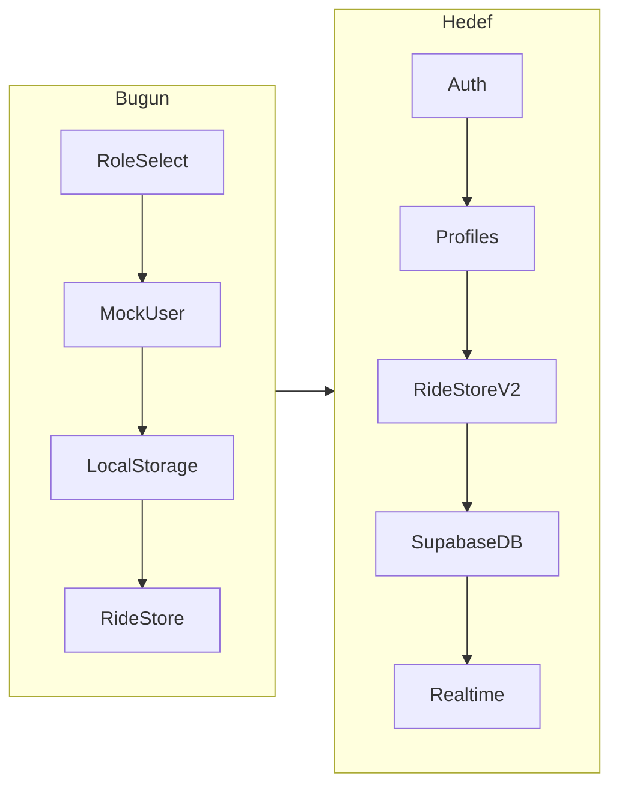

# AdaGo Supabase Aşamalı Migration Planı

## Mevcut durum (başlangıç noktası)

- Kimlik: [`src/stores/rideStore.js`](src/stores/rideStore.js) içinde `setRole()` + `mockPassenger` / `mockDriver`
- Kalıcılık: LocalStorage `adago-state-v1` (rides + role + user + nearbyDrivers)
- Guard: [`src/router/index.js`](src/router/index.js) yalnızca `rideStore.currentRole` kontrol eder
- Korunacaklar: Leaflet, OSRM, Nominatim, ücret (`fare.js`), AdaGo UI



---

## Güvenlik kuralları (tüm aşamalar)

- Frontend env: yalnızca `VITE_SUPABASE_URL` + `VITE_SUPABASE_ANON_KEY`
- `service_role` asla Vue/Vite bundle’a girmez
- Tüm tablolarda RLS açık
- Secret’lar `.env` / `.env.local`; `.gitignore`’a eklenir; `.env.example` commit edilir

---

## Aşama 1 — Bağlantı + Auth + profiles + session + guard

**Amaç:** Mock rol seçimini gerçek hesap sistemine çevirmek. Ride/LocalStorage hâlâ çalışabilir; kullanıcı kaynağı değişir.

### SQL (Supabase SQL Editor / migration)

```sql
-- profiles
create table public.profiles (
  id uuid primary key references auth.users(id) on delete cascade,
  full_name text not null,
  phone text,
  role text not null check (role in ('passenger', 'driver')),
  created_at timestamptz not null default now(),
  updated_at timestamptz not null default now()
);

alter table public.profiles enable row level security;

create policy "profiles_select_own"
  on public.profiles for select
  using (auth.uid() = id);

create policy "profiles_update_own"
  on public.profiles for update
  using (auth.uid() = id)
  with check (auth.uid() = id);

-- Insert: trigger ile (client insert kapalı tutulabilir)
create policy "profiles_insert_own"
  on public.profiles for insert
  with check (auth.uid() = id);

-- Auth signup metadata -> profile
create or replace function public.handle_new_user()
returns trigger
language plpgsql
security definer
set search_path = public
as $$
begin
  insert into public.profiles (id, full_name, phone, role)
  values (
    new.id,
    coalesce(new.raw_user_meta_data->>'full_name', 'AdaGo Kullanıcı'),
    new.raw_user_meta_data->>'phone',
    coalesce(new.raw_user_meta_data->>'role', 'passenger')
  );
  return new;
end;
$$;

create trigger on_auth_user_created
  after insert on auth.users
  for each row execute function public.handle_new_user();
```

Kayıt formu `signUp({ email, password, options: { data: { full_name, phone, role } } })` gönderir. Sürücü araç alanları **Aşama 2**.

### Yeni / değişecek dosyalar (Aşama 1)

| Dosya | İş |
|-------|-----|
| `.env.example` | `VITE_SUPABASE_URL`, `VITE_SUPABASE_ANON_KEY` |
| `.gitignore` | `.env`, `.env.local` |
| `package.json` | `@supabase/supabase-js` ekle |
| `src/lib/supabase.js` | `createClient` singleton |
| `src/stores/authStore.js` | session, profile, signUp/signIn/signOut, `initSession()` |
| `src/views/LoginView.vue` | e-posta/şifre giriş |
| `src/views/RegisterView.vue` | ad, telefon, rol (yolcu/sürücü), e-posta, şifre |
| `src/router/index.js` | `/login`, `/register`; guard: auth + `profile.role` |
| `src/main.js` | mount öncesi `authStore.initSession()` |
| `src/views/RoleSelectView.vue` | ya kaldırılır ya da login sonrası “hesabın rolü X” bilgilendirme / yönlendirme |
| `src/components/Navbar.vue` | çıkış + gerçek isim/rol |
| `src/views/ProfileView.vue` | `authStore.profile` okur; mock `setRole` kaldırılır |
| `src/stores/rideStore.js` | `currentRole` / `currentUser` kaynağını authStore’a bağla (thin adapter); LocalStorage ride’lar Aşama 3’e kadar kalabilir |
| `AGENTS.md` | V2: Supabase Auth/DB notu |

### Guard davranışı (Aşama 1)

- Oturum yok → `/login`
- Oturum var, `profile.role !== meta.role` → kendi rol paneline veya `/`
- `/passenger` yalnız `passenger`, `/driver` yalnız `driver`
- `/role` mock seçim olmaktan çıkar

### Aşama 1 sonrası durum

- Gerçek kayıt/giriş çalışır
- Mock kullanıcılar auth için kullanılmaz
- Rides hâlâ LocalStorage (bilinçli geçici durum)
- Harita / OSRM / Nominatim / ücret aynı

---

## Aşama 2 — drivers + vehicles + online/offline + cihaz konumu

### SQL

```sql
create table public.drivers (
  id uuid primary key references public.profiles(id) on delete cascade,
  is_online boolean not null default false,
  rating numeric(2,1) not null default 5.0,
  completed_trips int not null default 0,
  last_lat double precision,
  last_lng double precision,
  last_location_at timestamptz,
  updated_at timestamptz not null default now()
);

create table public.vehicles (
  id uuid primary key default gen_random_uuid(),
  driver_id uuid not null references public.drivers(id) on delete cascade,
  vehicle_type text not null,
  plate text,
  model text,
  color text,
  is_active boolean not null default true,
  created_at timestamptz not null default now()
);

-- RLS: sürücü kendi satırını okur/yazar; yolcu online sürücüleri SELECT edebilir
```

RLS özeti:

- `drivers`: sahibi full access; authenticated yolcular `is_online = true` satırları SELECT
- `vehicles`: sahibi CRUD; yolcu sadece aktif aracın type/model bilgisini SELECT (plate opsiyonel gizlenebilir)

### Uygulama

- Kayıtta `role=driver` → `drivers` + ilk `vehicles` satırı (register genişletmesi veya sürücü onboarding ekranı)
- `DriverView`: Online/Offline toggle → `drivers.is_online`
- `navigator.geolocation.watchPosition` → `last_lat/lng/last_location_at` (throttle ~3–5 sn)
- Yolcu haritasında mock `nearbyDrivers` yerine DB’den online sürücüler (Realtime henüz şart değil; polling veya Aşama 4 kanalı)

---

## Aşama 3 — rides tablosu + LocalStorage ride migration

### SQL (mevcut alanlarla uyumlu)

```sql
create type public.ride_status as enum (
  'Bekliyor', 'Kabul Edildi', 'Tamamlandı', 'İptal Edildi'
);
create type public.trip_phase as enum (
  'Sürücü atanıyor', 'Sürücü yolda', 'Yolculuk başladı', 'Yolculuk tamamlandı'
);

create table public.rides (
  id uuid primary key default gen_random_uuid(),
  passenger_id uuid not null references public.profiles(id),
  driver_id uuid references public.drivers(id),
  passenger_name text not null,
  phone text,
  from_label text not null,
  to_label text not null,
  from_lat double precision not null,
  from_lng double precision not null,
  to_lat double precision not null,
  to_lng double precision not null,
  route jsonb default '[]'::jsonb,
  distance_km numeric,
  duration_min numeric,
  estimated_fare numeric,
  status public.ride_status not null default 'Bekliyor',
  trip_phase public.trip_phase,
  created_at timestamptz not null default now(),
  accepted_at timestamptz,
  completed_at timestamptz,
  cancelled_at timestamptz
);
```

RLS özeti:

- Yolcu: kendi ride INSERT + SELECT + (PENDING/EN_ROUTE/IN_PROGRESS iken) CANCEL update
- Sürücü: PENDING ride SELECT (marketplace); ACCEPT/START/COMPLETE kendi atandığı ride üzerinde UPDATE
- Status geçişleri mümkünse DB check / RPC ile sıkılaştırılır (`accept_ride`, `start_ride`, `complete_ride`, `cancel_ride`)

### Uygulama

- `rideStore` aksiyonları Supabase CRUD’a taşınır
- `adago-state-v1` içinden `rides` yazımı kaldırılır (veya key sadece UI prefs için kalır)
- Manuel lifecycle korunur: Kabul → Başlat → Tamamla
- OSRM sonucu `route` jsonb olarak saklanır

---

## Aşama 4 — Realtime senkronizasyon

- `rides` tablosunda Realtime publication aç
- Yolcu: kendi `ride.id` kanalını dinler → `tripPhase` / `status` anında UI
- Sürücü: pending list + aktif ride değişikliklerini dinler
- İsteğe bağlı: `drivers` location update publication (yolcu haritası canlı marker)
- Pinia’da subscribe/unsubscribe `onMounted`/`onUnmounted`

---

## Aşama 5 — PostGIS yakındaki sürücüler

```sql
create extension if not exists postgis;
-- drivers.last_location geography(Point, 4326) generated veya trigger ile güncelle
-- RPC: nearby_drivers(lat, lng, radius_m)
```

- Yolcu pickup koordinatına göre online sürücüleri mesafeyle döndür
- Leaflet’te gerçek marker’lar; mock `initialNearbyDrivers` kaldırılır
- `findNearestDriver` store mantığı RPC sonucuna dayanır

---

## Migration sırası (uygulama disiplini)

1. Supabase proje + Auth e-posta provider
2. Aşama 1 SQL + RLS + trigger
3. Frontend env + client + authStore + login/register + guard
4. Smoke test: kayıt → profil oluşur → role paneli açılır → logout
5. Aşama 2 SQL + sürücü online + geolocation
6. Aşama 3 rides SQL + rideStore migrasyonu + LocalStorage rides kapatma
7. Aşama 4 Realtime
8. Aşama 5 PostGIS RPC

Her aşama sonunda: `npm run build` + ilgili manuel senaryo testi. Bir sonraki aşamaya geçmeden önceki aşama stabil olmalı.

---

## Bilinçli sınırlar (şimdi kod yok)

- Bu doküman plan; implementasyon Aşama 1 onayıyla başlar
- Secret key kullanılmaz
- Leaflet/OSRM/Nominatim/fare/UI redesign yapılmaz
- Tüm 5 aşama tek PR’da birleştirilmez
